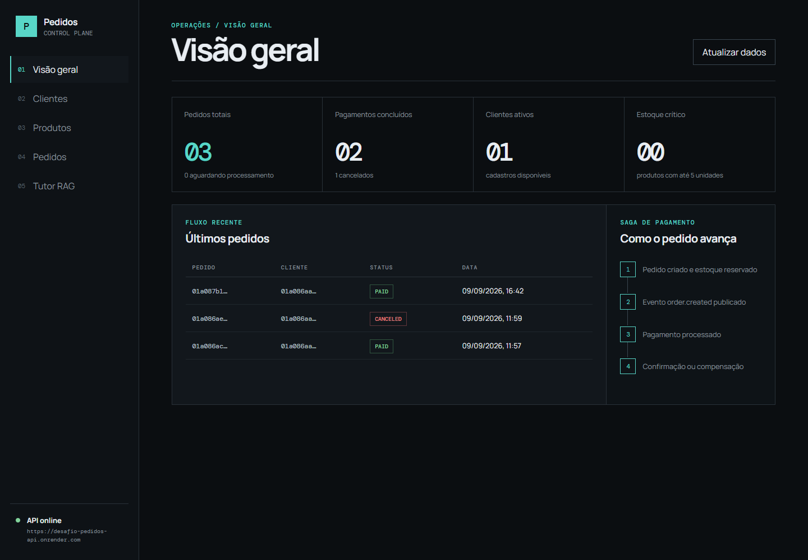
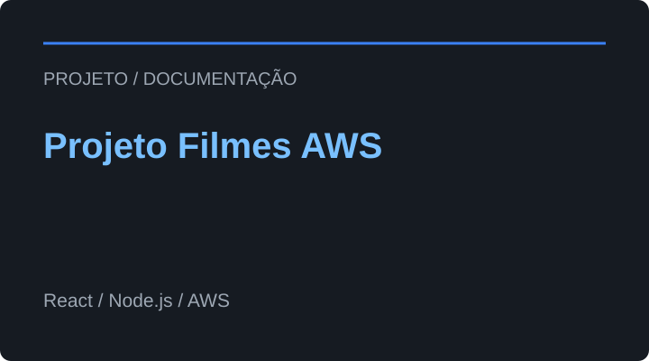
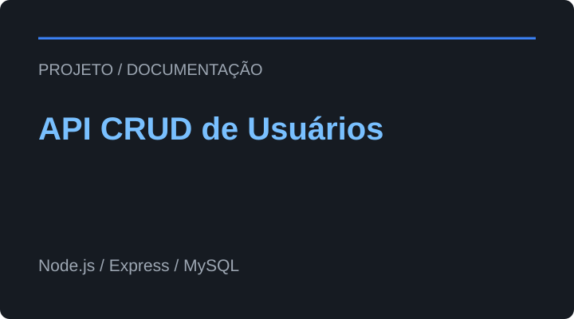
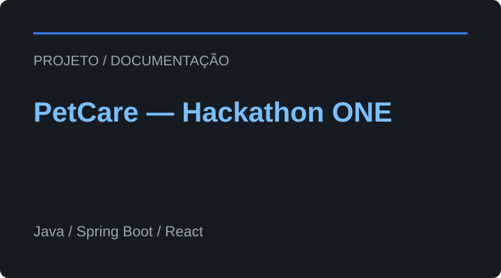
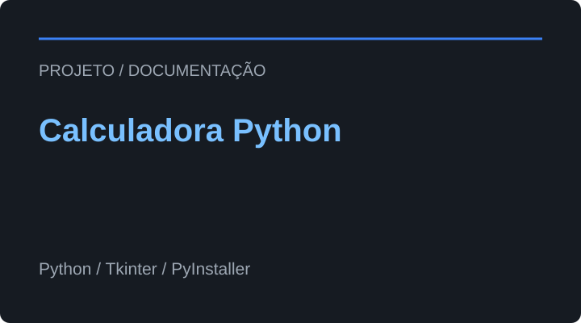
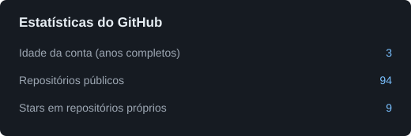
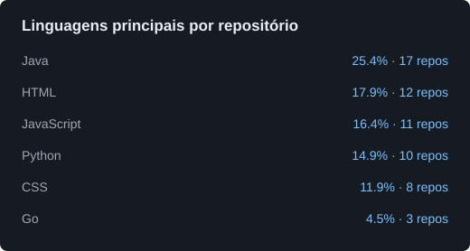

# Olá, eu sou o Marcelo Rodrigues

## Desenvolvedor Full Stack | Estudante de Ciência da Computação

Projetos em front-end e back-end, com interesse em DevOps, segurança e computação em nuvem.

---

## Sobre Mim

Sou estudante de Ciência da Computação na Anhanguera e desenvolvo projetos com Go, Java, JavaScript e Python. Minha prática envolve APIs REST, bancos relacionais e aplicações full stack, com atenção à organização do código, documentação e testes.

Busco minha primeira oportunidade como estagiário ou desenvolvedor back-end júnior. Valorizo comunicação clara, colaboração em equipe e aprendizado contínuo. Tenho interesse em arquitetura de software, DevOps, segurança e computação em nuvem.

---

## Projetos em Destaque

Clique nas imagens para abrir a demo ou o repositório. Expanda as decisões documentadas e use os botões para acessar código, demo ou documentação.

<table>
<tr>
<td valign="top" width="33%">

<h3>Sistema de Pedidos em Go</h3>

Pedidos, reserva de estoque e pagamentos fictícios com processamento assíncrono, painel web e tutor documental.

<strong>Go · PostgreSQL · RabbitMQ · React · RAG</strong>

Último push: 2026-10-02 · Stars: 0

Decisões documentadas

<ul><li>Saga compensa falhas de pagamento e devolve o estoque.</li><li>Camadas separam domínio, casos de uso e persistência.</li><li>O tutor documental indica fontes e recusa respostas sem evidência.</li></ul>

<a href="https://github.com/MarceloRodrigues1853/ada_go-desafio_pedidos#readme">Ler documentação</a>

A demo usa hospedagem gratuita; os serviços podem demorar na primeira chamada.

 

</td>
<td valign="top" width="33%">

<h3>NutriFit</h3>

E-commerce demonstrativo com catálogo, cadastro, login e checkout simulado. Evolução de um projeto integrador em equipe.

<strong>Node.js · Express · TiDB Cloud · JavaScript</strong>

Último push: 2026-08-31 · Stars: 1

Decisões documentadas

<ul><li>Front-end, API e banco ficam em serviços independentes.</li><li>Senhas usam bcrypt; consultas são parametrizadas e a conexão com o banco usa TLS.</li><li>Testes de cadastro e autenticação usam conexão simulada.</li></ul>

<a href="https://github.com/MarceloRodrigues1853/Nutrift#readme">Ler documentação</a>

Produtos e pagamentos são demonstrativos. A API gratuita pode demorar na primeira chamada.

 

</td>
<td valign="top" width="33%">

<h3>Projeto Filmes AWS</h3>

Catálogo de filmes com autenticação JWT, avaliações e recomendações, desenvolvido no curso de Aprofundamento Cloud Proz + AWS.

<strong>React · Node.js · AWS · Docker</strong>

Último push: 2025-10-01 · Stars: 0

Decisões documentadas

<ul><li>MySQL no RDS e imagens no S3 separam dados e arquivos.</li><li>Containers em EC2, Nginx e HTTPS compõem a infraestrutura.</li><li>GitHub Actions automatiza build e atualização dos containers.</li></ul>

<a href="https://github.com/MarceloRodrigues1853/projeto_filmes_aws#readme">Ler documentação</a>

 

</td>
</tr>
<tr>
<td valign="top" width="33%">

<h3>API CRUD de Usuários</h3>

API REST para criar, consultar, atualizar e remover usuários, com exemplos de execução e testes manuais no Postman.

<strong>Node.js · Express · MySQL</strong>

Último push: 2026-01-12 · Stars: 0

Decisões documentadas

<ul><li>Connection pool reutiliza conexões com o MySQL.</li><li>Placeholders evitam concatenar entradas nas consultas SQL.</li><li>Rotas e conexão com o banco têm responsabilidades separadas.</li></ul>

<a href="https://github.com/MarceloRodrigues1853/api-crud-node-mysql#readme">Ler documentação</a>

 

</td>
<td valign="top" width="33%">

<h3>PetCare — Hackathon ONE</h3>

Plataforma de cuidados com pets da Equipe 2 — Brasil. Minha participação é descrita como integração e apoio full stack.

<strong>Java · Spring Boot · React · MySQL · Docker</strong>

Último push: 2025-09-22 · Stars: 0

Decisões documentadas

<ul><li>Docker Compose organiza front-end, back-end e MySQL.</li><li>Swagger documenta os endpoints para a integração.</li><li>MVP educacional: login JWT e reservas constam como próximos passos na documentação consultada.</li></ul>

<a href="https://github.com/MarceloRodrigues1853/petcare-Hackathon_ONE#readme">Ler documentação</a>

 

</td>
<td valign="top" width="33%">

<h3>Calculadora Python</h3>

Calculadora com interface gráfica e registro persistente das operações, acompanhada de guia de compilação.

<strong>Python · Tkinter · PyInstaller</strong>

Último push: 2026-01-23 · Stars: 0

Decisões documentadas

<ul><li>Tkinter oferece uma interface desktop nativa.</li><li>O histórico é salvo em arquivo de texto com data e hora.</li><li>PyInstaller permite distribuir um executável.</li></ul>

<a href="https://github.com/MarceloRodrigues1853/calculadora-python-gui#readme">Ler documentação</a>

 

</td>
</tr>
</table>

[Conhecer as demos e os projetos selecionados no portfólio](https://challenge-one-portfolio-nine.vercel.app/#xp)

---

## Stack Tecnológica

Tecnologias utilizadas em projetos e formações.

### Linguagens

### Frontend

### Backend

### Banco de Dados

### Cloud & DevOps

### IA aplicada

Agentes de IA, orquestração de fluxos e recuperação de evidências documentais com RAG.

### Segurança & Qualidade

### Monitoramento & Observabilidade

---

## Educação e Certificações

- Bacharelado em Ciência da Computação — Anhanguera. Em andamento; conclusão prevista para outubro de 2027.
- Ser+Tech Núclea — formações em Back-end Java e Go, Ada / Núclea, 2026.
- Google Cybersecurity — Google / Coursera, 2025.
- Ensino Médio — E.E.E.M Gomercinda Dornelles da Fontoura. Concluído.

[Consultar formação e credenciais](https://challenge-one-portfolio-nine.vercel.app/#formacao)

---

## Experiência Profissional

### Motorista Autônomo

*Desde 2021 — Rio Grande do Sul*

- Gestão de atividades logísticas e planejamento de rotas.
- Organização da rotina e cumprimento de prazos.
- Atendimento ao cliente e comunicação durante as entregas.

Essa experiência contribui com responsabilidade, gestão de tempo e organização no desenvolvimento de software.

---

## Projetos Atualizados Recentemente

Ver projetos com os pushes mais recentes

Projetos próprios atualizados automaticamente, sem incluir forks, repositórios arquivados ou este repositório de perfil.

- **[challenge-ONE-portfolio](https://github.com/MarceloRodrigues1853/challenge-ONE-portfolio)** — repositório criado como parte de desafio de projeto da Formação Front-End\_ONT6 Alura
  Linguagem principal: HTML · Stars: 0 · Último push: 2026-10-05

- **[ada\_go-desafio\_pedidos](https://github.com/MarceloRodrigues1853/ada_go-desafio_pedidos)** — Repositório criado para o desevolvimento dos módulos da formação em Go da ADA Ser+Tech Núclea.
  Linguagem principal: Go · Stars: 0 · Último push: 2026-10-02

- **[jungle-gaming-backend-challenge](https://github.com/MarceloRodrigues1853/jungle-gaming-backend-challenge)** — Desafio técnico Backend Developer — Go (Jungle Gaming)
  Linguagem principal: Go · Stars: 0 · Último push: 2026-09-27

- **[go-oauth2-google](https://github.com/MarceloRodrigues1853/go-oauth2-google)** — Projeto desenvolvido para explorar os fluxos de delegação de acesso utilizando o padrão OAuth 2.0 e OpenID Connect na linguagem Go.
  Linguagem principal: Go · Stars: 0 · Último push: 2026-07-20

- **[ada-java-programacao-web-2-exercicios](https://github.com/MarceloRodrigues1853/ada-java-programacao-web-2-exercicios)** — Repositório criado para fins de estudo e compartilhamento de codigos e exercicos proprostos na aulas de progaramção web faciliatando a replicação e entendimento do modulo
  Linguagem principal: Java · Stars: 0 · Último push: 2026-06-04

- **[api\_books\_java](https://github.com/MarceloRodrigues1853/api_books_java)** — API RESTful desenvolvida em Java e Spring Boot com implementação de Spring Security. Projeto criado com fins puramente acadêmicos para estudo prático, consulta e compartilhamento de código.
  Linguagem principal: Java · Stars: 0 · Último push: 2026-06-04

[Ver todos os repositórios](https://github.com/MarceloRodrigues1853?tab=repositories)

---

## Atividade no GitHub

Ver estatísticas e tecnologias por uso

### Estatísticas do GitHub

Dados consultados em **2026-10-06**. Repositórios públicos incluem forks; stars são somadas apenas nos projetos próprios. Quando disponíveis, commits, issues, PRs e reviews representam contribuições dos últimos 12 meses retornadas pelo GitHub.

[Consultar contribuições no perfil](https://github.com/MarceloRodrigues1853?tab=overview)

### Tecnologias por uso

- **Java** — 25.8% (17 repositórios)
- **HTML** — 18.2% (12 repositórios)
- **JavaScript** — 16.7% (11 repositórios)
- **Python** — 13.6% (9 repositórios)
- **CSS** — 12.1% (8 repositórios)
- **Go** — 4.5% (3 repositórios)

Percentuais calculados pela quantidade de repositórios públicos próprios com cada linguagem principal. A lista mostra até seis linguagens; não representa proficiência ou volume de código.

---

## Freelance e Serviços

Disponível para conversar sobre pequenos projetos e tarefas técnicas:

- **Python e Bash:** scripts de automação e tarefas em Linux.
- **Node.js e Flask:** APIs, integrações com bancos de dados e operações CRUD.
- **Desenvolvimento web:** páginas responsivas e funcionalidades em JavaScript.
- **Segurança:** aplicação de práticas básicas de proteção nos projetos.

---

## Contato

Aberto a oportunidades de estágio, desenvolvimento back-end júnior e colaboração em projetos.

Clique nos botões para visitar meus perfis ou escrever um e-mail.

[Portfólio](https://challenge-one-portfolio-nine.vercel.app/ "Visitar meu portfólio") · [LinkedIn](https://www.linkedin.com/in/marcelorodriguesdev1853/ "Abrir meu perfil no LinkedIn") · [Instagram](https://www.instagram.com/marcelo180886/ "Abrir meu perfil no Instagram") · [E-mail](mailto:marcelo180886@gmail.com "Abrir seu aplicativo de e-mail para escrever uma mensagem")

